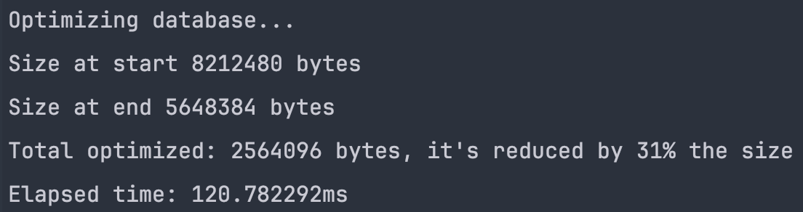

<div align=center>
<h1>Sqlite Cleaner</h1>
</div>


<div align="center">
        
    
    
</div>

## Description

SQlite Cleaner is a program made to be run to clean the database. It will
reduce the storage of the database and optimise all tables except system tables. It is a simple and efficient way to
keep your
database clean and optimised without having to do it manually. It is a great way to keep your database running in the
best conditions possible. Using Rust, it is compatible with all platforms and can be run on any server or application.
Check in the releases to download the program.

## Features

<ul>
<li>Reduce storage of the database</li>
<li>Optimise all tables except system tables</li>
<li>Simple and efficient way to keep your sqlite database clean</li>
<li>Compatible with all platforms</li>
<li>Maintain your database in the best conditions possible</li>
<li>Don't require any dump or backup</li>
<li>Don't modify your files configuration</li>
<li>Easily run on any server or application</li>
<li>Easy to use</li>
</ul>

## Platforms & Requirements

<div align="center">


</div>

<div align="center">


</div>

## Example of execution

<div align="center">

</div>

## Installation

To run the program :

1. Clone the repository:

```bash
git clone https://github.com/Maxime-Cllt/SqliteCleaner.git
```

2. Build the program:

```bash
cargo build --release
```

3. Execute the program:

You may need to give the program the right to execute on linux and macOS:

```bash
chmod +x target/release/SqliteCleaner
```

### MacOS & Linux

```bash
cd target/release/SqliteCleaner "path/to/your_database.db"
```

### Windows

```bash
cd target/release/SqliteCleaner.exe "path/to/your_database.db"
```

## Notes

- Time complexity: O(n) where n is the number of tables in the database
- Don't clean triggers, stored procedures, functions, and views
- May not reduce much storage but don't cost much time to run and can be run frequently

## See Also

<ul>
<li><a href="https://github.com/Maxime-Cllt/DBMSCleaner" target="_blank">DBMSCleaner</a></li>
</ul>


